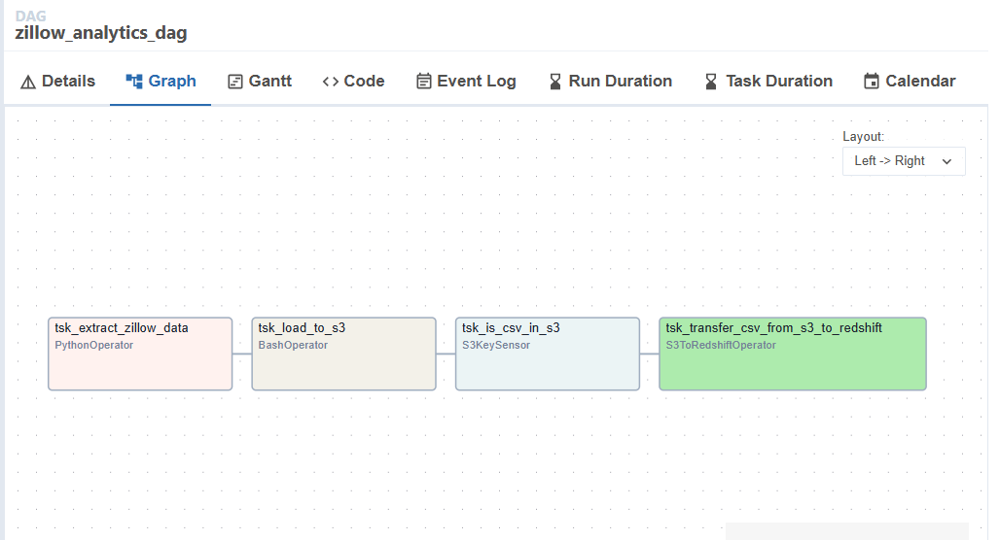
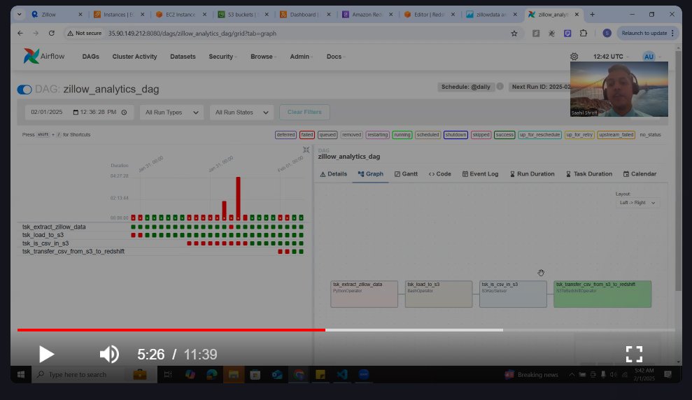
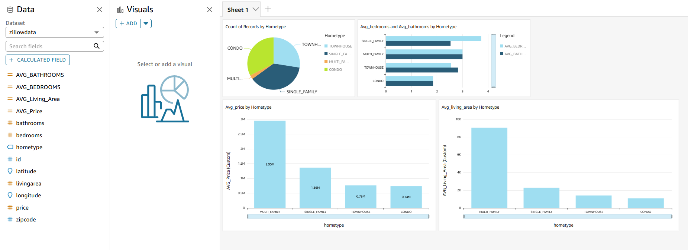

# Zillow-airflow-analytics
This project builds an end-to-end Zillow data pipeline using Python, RapidAPI, AWS (S3, Lambda, Redshift), Apache Airflow, and Amazon QuickSight for automation, transformation, and visualization.

## Table of Contents
- [Architecture](#Architecture)
- [Demo](#Demo)
- [DAG diagram](#DAG)
- [Python Code](#Code)
- [Visualization](#Visualization)
- [Learnings](#Learnings)
- [Acknowledgments](#acknowledgments)
- [Miscellaneous Files](#Miscellaneous)

## Architecture


## DAG


## Demo

Click on the thumbnail below. You will be redirected to YouTube. Enjoy! :D

[](https://youtu.be/RYipQSIS-MU)


## Code
Python file:


config_api.json file:
```bash
{
	"x-rapidapi-key": "<API-KEY>",
	"x-rapidapi-host": "zillow56.p.rapidapi.com"
}
```

## Visualization


## Learnings
- Airflow Orchestration and DAG
- AWS
    - Creating an EC2 instance
    - SSH Connection
    - Lambda functions
    - Redshift connection
    - Quicksight
- Airflow & AWS connections - AWS & Redshift 

## Acknowledgments


## Miscellaneous
Screenshots of individual components of the orchestration. Found in the ```misc``` folder